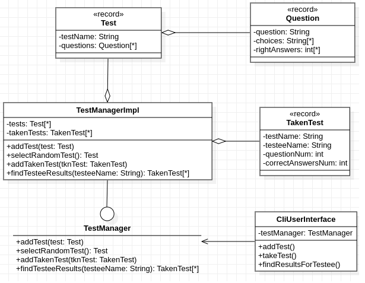
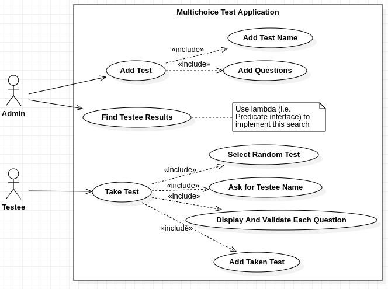
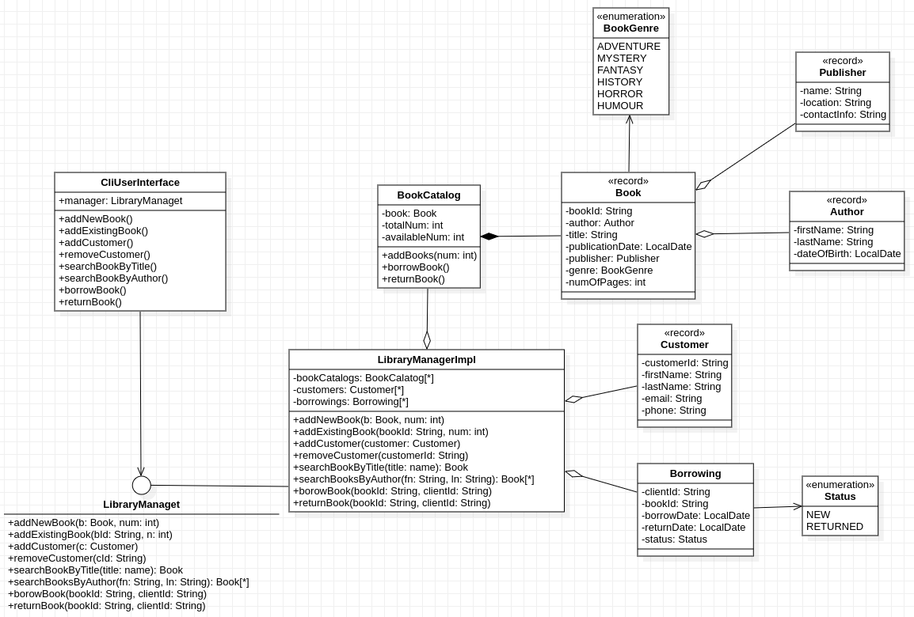
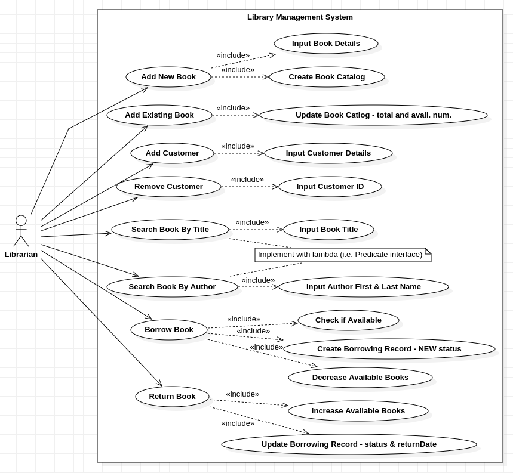

# Implement the following exercises

In this lab you will create two small Java applications by using UML diagrams as reference. Please consider the following general notes before start implementing:

1. Look at some LocalDate examples in edu.tucn.isp.ex0.LocalDateExample and edu.tucn.isp.ex0.RecordWithLambdaExample
2. Create the Java application based on the provided UML diagrams.
3. Add needed constructors, getters, setters, toString() and any other method you consider necessary.
4. Implement the main method in edu.tucn.isp.ex(1|2).Exercise(1|2).
5. Implement the unit tests provided in the corresponding section.

## Exercise 1

Given the UML class diagram above, implement the corresponding Java program.
Have a look at the UML use-case diagram below for more implementation details.

## Exercise 2

Given the UML class diagram above, implement the corresponding Java program.
Have a look at the UML use-case diagram below for more implementation details.

